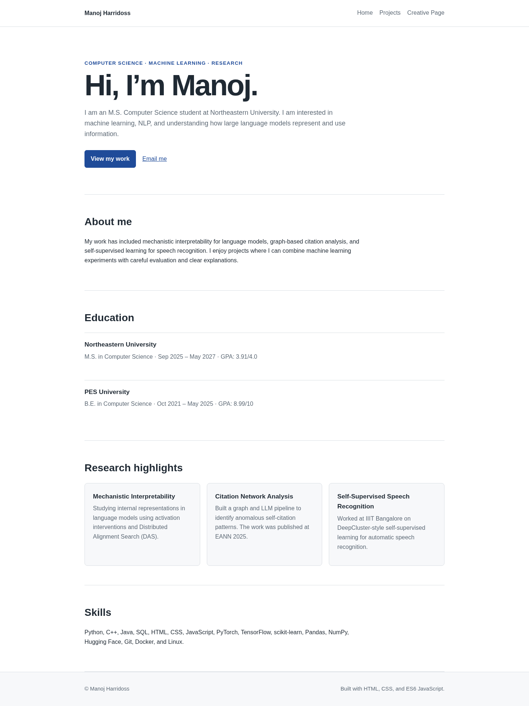

# Manoj Harridoss — Personal Homepage

## Author

Manoj Harridoss — MS Computer Science, Northeastern University
Email: harridoss.m@northeastern.edu

## Class

CS 5610 — Web Development, Northeastern University

**Class link:** [https://johnguerra.co/classes/webDevelopment_online_fall_2026/](https://johnguerra.co/classes/webDevelopment_online_fall_2026/)

## Project objective

A small personal homepage built with vanilla HTML5, CSS3, and ES6 JavaScript modules. The site introduces me, shows what I am working on (with live GitHub and LeetCode activity), lists selected projects, and includes an interactive research page. There is no framework, no build step, and no backend.

## Pages

- `index.html` — homepage with intro, coding activity (GitHub + LeetCode), education, and skills.
- `projects.html` — selected research and course projects.
- `explore.html` — Research Lab: interactive constellation of research topics, a cross-area idea generator, and a rotating set of open research questions.

## Screenshot



## Folder structure

```
.
├── assets/
│   └── images/
├── css/
│   ├── creative.css
│   └── main.css
├── design/
│   └── design.md
├── js/
│   ├── creative.js
│   └── main.js
├── explore.html
├── index.html
├── projects.html
├── eslint.config.js
├── LICENSE
├── package.json
└── README.md
```

## Technology

- HTML5
- CSS3 (Grid + Flexbox, custom properties)
- ES6+ JavaScript modules
- No frameworks, no build step, no backend

## Live data sources

- GitHub contributions: `https://github-contributions-api.jogruber.de/v4/{user}`
- LeetCode stats and submission calendar: `https://leetcode-api-faisalshohag.vercel.app/{user}`

Both are public third-party endpoints. If they are unavailable the page shows a graceful fallback message.

## Run locally

1. Install Node.js.
2. `npm install`
3. `npm run start`
4. Open the local URL shown in the terminal.

## Formatting and linting

```bash
npm run format        # apply Prettier
npm run format:check  # verify Prettier formatting
npm run lint          # run ESLint (uses the class eslint.config.js)
npm run check         # format:check + lint
```

## W3C validation

Before submission, deploy the site and validate every HTML page at <https://validator.w3.org/>. Fix any errors reported.

## Deployment (GitHub Pages)

1. Push the project to a GitHub repository.
2. In the repository, open **Settings → Pages**.
3. Under **Build and deployment**, choose **Deploy from a branch**.
4. Select `main` branch and `/ (root)` folder.
5. Save. GitHub prints the public URL once the build is done.
6. Open the public URL in an incognito window to confirm all three pages and both live data feeds work.

## Video

_Record a short narrated public video demonstrating the homepage (with coding activity), the projects page, and the Research Lab. Add the video URL here before submission._

**Video link:** _add here_

## Google Form submission

- Use the deployed public URL.
- Confirm the thumbnail loads.
- Test every link in an incognito window before submitting.

## GenAI use

- **Model used:** Claude Sonnet 4.6 by Anthropic.
- **How it was used:** Scaffolding the initial file structure, writing the ES6 modules for the typing animation and the GitHub/LeetCode calendar renderers, generating the CSS palette, and drafting the design document. All content (research descriptions, project entries, thought experiments, personas, user stories) is authored by me and reflects my actual work, education, and interests.
- **Prompt summary (representative):**
  1. "Build a small personal homepage for a CS master's student using only vanilla HTML, CSS, and ES6 modules; three pages; include a photo, coding activity from GitHub and LeetCode, and an interactive research page."
  2. "Render a GitHub contribution grid and a LeetCode submission calendar with a year selector, using vanilla JavaScript and the public APIs."
  3. "Write a design document with three user personas, ten user stories tied to an MS CS student's resume, and text mockups of each page."

## Code review

_Complete the required course code-review process. Add any evidence link here if the submission instructions ask for it._

## License

MIT — see `LICENSE`.
