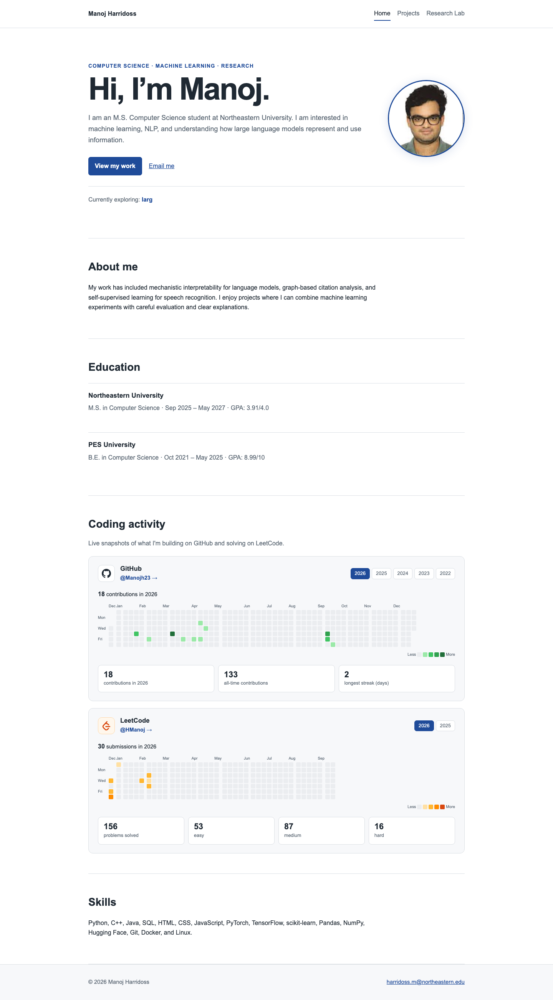
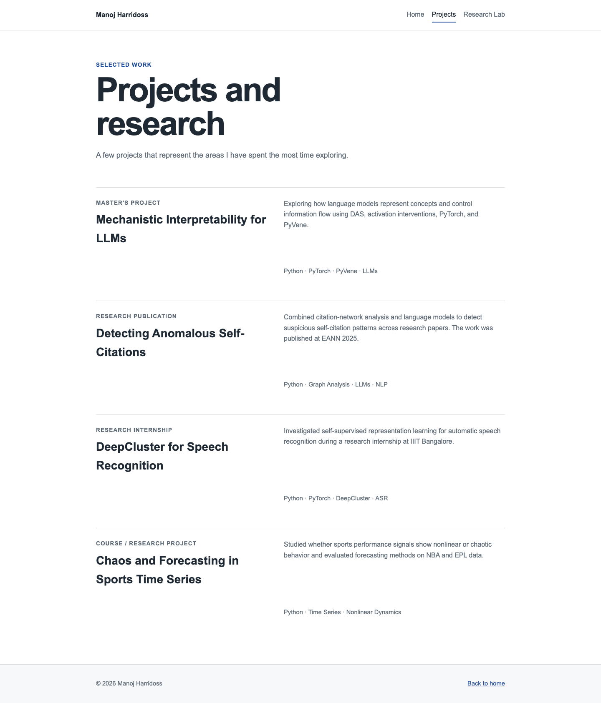
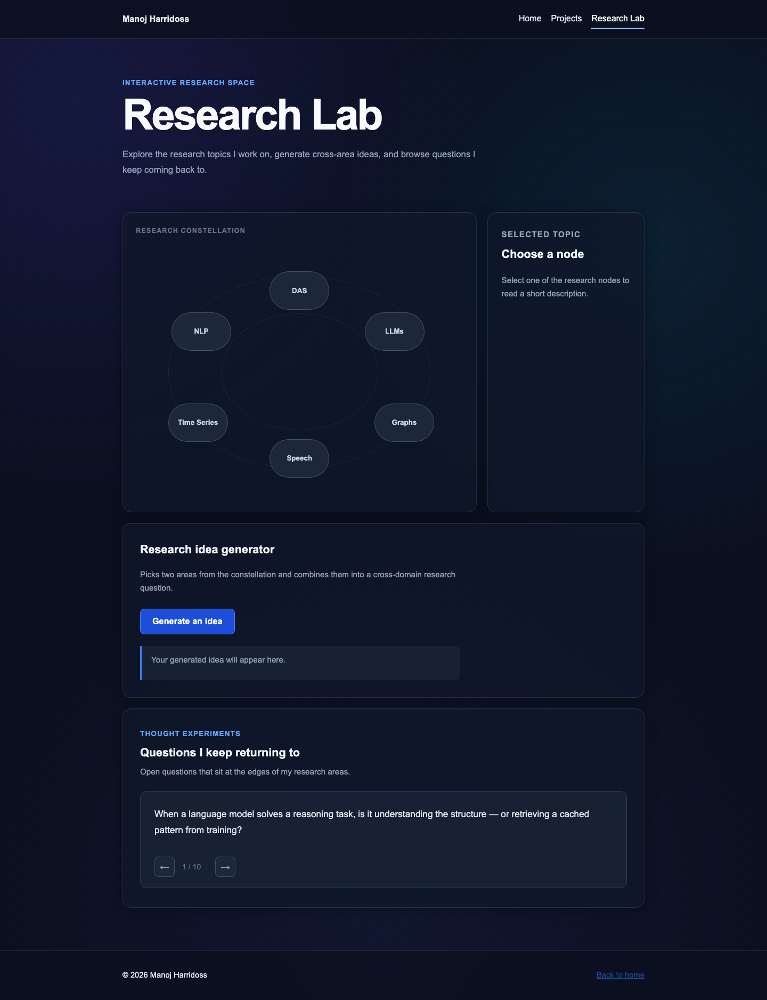

# Manoj Harridoss — Personal Homepage

**Live site:** <https://manojh23.github.io/manoj_cs5610_project1/>

## Author

Manoj Harridoss — MS Computer Science, Northeastern University
Email: harridoss.m@northeastern.edu

## Class

CS 5610 — Web Development, Northeastern University

**Class link:** <https://johnguerra.co/classes/webDevelopment_online_fall_2026/>

## Project objective

A small personal homepage built with vanilla HTML5, CSS3, and ES6 JavaScript modules. The site introduces me, shows what I am working on (with live GitHub and LeetCode activity), lists selected projects, and includes an interactive research page. There is no framework, no build step, and no backend.

## Pages

- `index.html` — homepage with intro, coding activity (GitHub + LeetCode), education, and skills.
- `projects.html` — selected research and course projects.
- `explore.html` — Research Lab: interactive constellation of research topics, a cross-area idea generator, and a rotating set of open research questions.

## Screenshots

### Home



### Projects



### Research Lab



## Folder structure

```
.
├── assets/
│   └── images/
├── css/
│   ├── creative.css
│   └── main.css
├── design/
│   ├── design.md
│   └── mockups/
├── js/
│   ├── creative.js
│   └── main.js
├── explore.html
├── index.html
├── projects.html
├── eslint.config.js
├── LICENSE
├── package.json
└── README.md
```

## Technology

- HTML5
- CSS3 (Grid + Flexbox, custom properties)
- ES6+ JavaScript modules
- No frameworks, no build step, no backend

## Live data sources

- GitHub contributions: `https://github-contributions-api.jogruber.de/v4/{user}`
- LeetCode stats and submission calendar: `https://leetcode-api-faisalshohag.vercel.app/{user}`

Both are public third-party endpoints. If they are unavailable the page shows a graceful fallback message.

## Run locally

1. Install Node.js.
2. `npm install`
3. `npm run start`
4. Open the local URL shown in the terminal.

## Formatting and linting

```bash
npm run format        # apply Prettier
npm run format:check  # verify Prettier formatting
npm run lint          # run ESLint
npm run check         # format:check + lint
```

## Video

**Video link:** <https://www.youtube.com/watch?v=CN9LVdvP5QM>

## Use of GenAI

I created the first two pages of the website myself. I used GenAI only to help with the third creative page, Research Lab.
- Tool and model: Claude (Anthropic), Sonnet 4.6 and Opus 5.5.
- What it helped with: building the interactive research page, including the research constellation, topic descriptions, idea generator, and research question navigation.
- What I did myself: the first two pages, all personal content, project information, research descriptions, and the overall website idea.
- Example prompt:
  “Create a dark-themed Research Lab page using vanilla HTML, CSS, and ES6 modules with an interactive research constellation, an idea generator, and research question cards.”
  
## Design Document

The design document, including the project description, user personas, user stories, and mockups, is in [`design/design.md`](design/design.md).

## License

MIT — see `LICENSE`.
