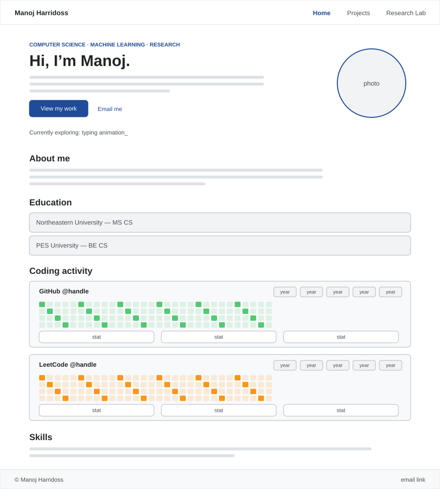
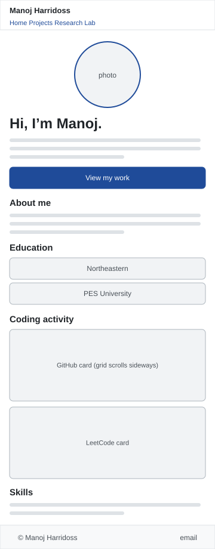
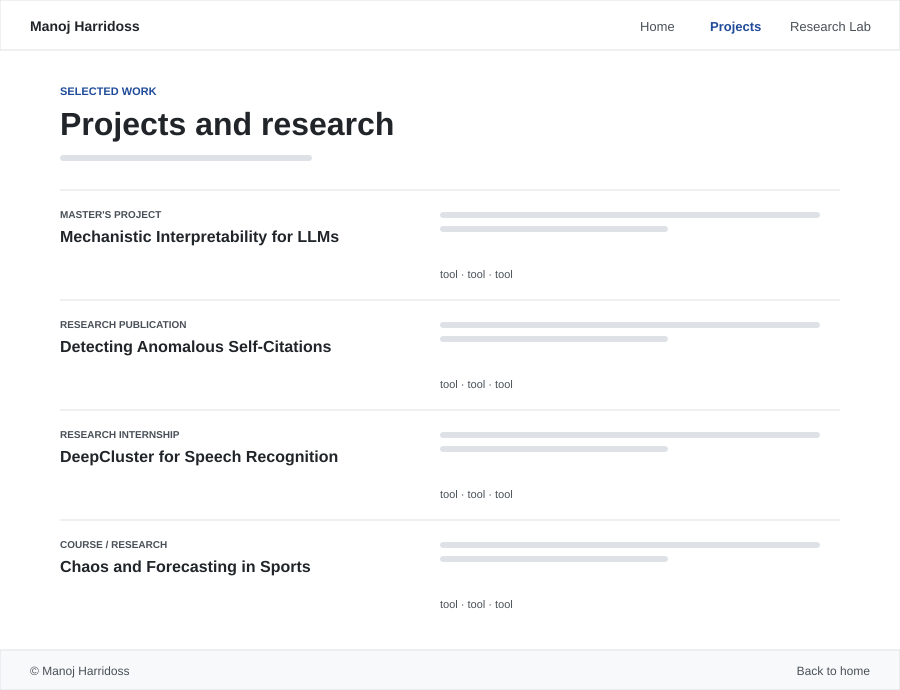
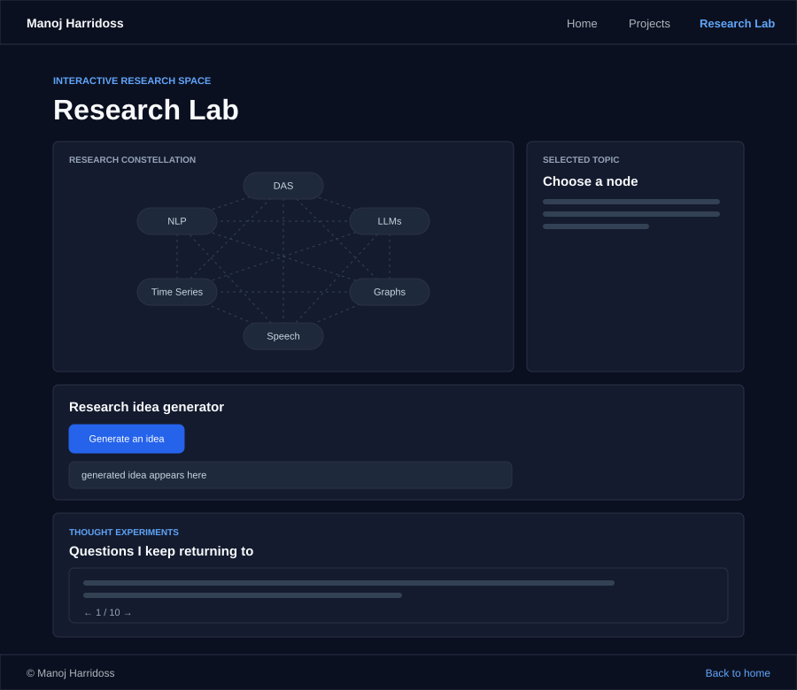

# Personal Homepage — Design Document

**Author:** Manoj Harridoss
**Course:** [CS 5610 — Web Development (Online), Northeastern University, Fall 2026](https://johnguerra.co/classes/webDevelopment_online_fall_2026/)
**Project:** Project 1 — Personal Homepage
**Live site:** https://manojh23.github.io/manoj_cs5610_project1/

---

## 1. Project description

### Overview

This project is a small personal website for Manoj Harridoss, a first-year MS Computer Science student at Northeastern University with a background in machine learning research. The site is meant to work like a lightweight online resume that a recruiter, professor, or fellow student can look through in under a minute and understand who Manoj is and what he works on.

### Objective

Build a simple, fast personal homepage that shows who I am, what I have worked on, and how I think about research — with real, live data instead of only claims.

### Pages

The site has three pages:

- **Home (`index.html`)** — introduction, a live GitHub/LeetCode coding activity view, education, and skills.
- **Projects (`projects.html`)** — a short list of research and course projects with the tools used.
- **Research Lab (`explore.html`)** — an interactive page that visualises how Manoj's research topics connect, generates cross-area research ideas, and shows a rotating set of open questions he thinks about.

### Technologies

- **HTML5** with semantic elements (`header`, `nav`, `main`, `section`, `article`, `footer`).
- **CSS3** with Grid, Flexbox, and custom properties. No CSS framework.
- **JavaScript (ES6+)** written as ES6 modules. No libraries.
- **Tooling:** ESLint and Prettier.
- **Hosting:** GitHub Pages.

The whole site is built with vanilla HTML5, CSS3, and ES6 modules. No frontend frameworks, no build step.

---

## 2. User personas

The site is written for three concrete kinds of visitors. All three come from Manoj's actual context: recruiter outreach, PhD/lab discussions, and student peers.

### Persona 1 — ML Recruiter

**Name:** Priya, technical recruiter at a ML/AI-focused company
**Background:** Sources candidates for ML engineering and applied research roles.
**What she wants from the site:**

- Confirm the degree (MS CS at Northeastern) and expected graduation.
- See tools she can filter for (Python, PyTorch, LLMs, NLP).
- See recent activity (GitHub commits, problems solved on LeetCode) as a signal that Manoj is actively coding.
- Get an email link within one click.

**Frustrations:** long bios before any real work, and portfolios with no sign of recent activity.

**How she reads the site:** lands on the homepage, scans the hero for the degree, checks the coding activity for freshness, opens the Projects page only if the profile looks like a fit.

### Persona 2 — Research Professor / PhD Advisor

**Name:** Dr. Chen, ML professor
**Background:** Runs an interpretability / NLP lab, evaluating potential research assistants.
**What she wants from the site:**

- See published work (Manoj's EANN 2025 self-citation paper).
- Understand the depth of research areas: mechanistic interpretability, DAS, LLMs, speech.
- Judge whether the student thinks in research questions or only in tasks.

**Frustrations:** research buried among unrelated coursework, and heavy buzzwords without substance.

**How she reads the site:** opens the Projects page first, then the Research Lab to read the thought experiments and see which topics are connected.

### Persona 3 — Fellow Graduate Student

**Name:** Jordan, another Northeastern CS student
**Background:** Looking for collaborators for course projects or research groups.
**What he wants from the site:**

- Find shared research areas.
- See the tech stack Manoj is comfortable with.
- Reach out casually via email or GitHub.

**Frustrations:** having to read everything when he only cares about one research area.

**How he reads the site:** clicks through the constellation on the Research Lab page, then goes to Projects, then follows the GitHub link.

### Why these personas

Each persona leads to a different page first: Priya to the homepage and coding activity, Dr. Chen to Projects, and Jordan to the Research Lab. Together they make sure every page has a clear reason to exist.

---

## 3. User stories

1. **As a recruiter,** I want to see the degree, university, and expected graduation on the homepage hero so that I can confirm eligibility for MS-level roles without opening a resume PDF.
2. **As a recruiter,** I want to see Manoj's live GitHub contribution graph and LeetCode submission calendar so that I can quickly judge whether he is actively coding right now.
3. **As a recruiter,** I want a one-click email link so that I can start an outreach without hunting through pages.
4. **As a research professor,** I want to see Manoj's EANN 2025 publication and the tools he used (Python, graph analysis, LLMs) so that I can decide whether his previous research is a fit for my lab.
5. **As a research professor,** I want to see how Manoj describes his own research areas (mechanistic interpretability, DAS, speech self-supervised learning) so that I can gauge how well he understands the space.
6. **As a research professor,** I want to see the questions he keeps returning to so that I can tell whether he is curious about the field or only chasing coursework.
7. **As a fellow student,** I want to browse an interactive map of Manoj's research topics so that I can find overlap with my own interests.
8. **As a fellow student,** I want to see the specific tools listed per project (PyTorch, PyVene, DeepCluster, graph analysis) so that I know whether we could pair on a project.
9. **As any visitor,** I want the site to be readable on a phone so that I can look at it while commuting between class buildings.
10. **As any visitor,** I want the navigation to look identical on every page so that I never get lost.

### Feature coverage

| Feature                       | Stories |
| ----------------------------- | ------- |
| Homepage hero (degree, photo) | 1       |
| GitHub and LeetCode calendars | 2       |
| Email link                    | 3       |
| Projects page                 | 4, 8    |
| Research constellation        | 5, 7    |
| Thought experiments           | 6       |
| Responsive layout             | 9       |
| Shared navigation             | 10      |

---

## 4. Design mockups

Simple wireframes of each page. The real pages follow these layouts.

### 4.1 Home page (desktop)

- Two-column hero: introduction on the left, circular photo on the right.
- A typing line under the hero shows what I am currently exploring.
- GitHub (green) and LeetCode (orange) cards each have a year selector and a row of stats.

### 4.2 Home page (mobile)

- The hero stacks vertically with the photo on top and a full-width button.
- The three navigation links stay visible, since a menu button would add an extra tap for only three pages.
- The contribution grids scroll sideways inside their cards instead of shrinking.

### 4.3 Projects page

- Each project is a row: label and title on the left, description and tools on the right.
- On mobile each row becomes a single column.

### 4.4 Research Lab

- A dark theme so the page feels separate from the resume-style pages.
- The constellation and the selected-topic panel sit side by side, so a visitor can read a topic without losing their place.
- The idea generator and thought experiments sit below as full-width cards.

---

## 5. Visual design decisions

- **Colour system.** A single blue accent (`#1f4b99`) on the light pages so the interactive elements read as one family. The Research Lab uses a dark background so it feels visually separate from the resume-style pages.

  | Role              | Color     |
  | ----------------- | --------- |
  | Text              | `#1f2933` |
  | Muted text        | `#5d6975` |
  | Border            | `#d9dee3` |
  | Surface           | `#f7f8fa` |
  | Accent            | `#1f4b99` |
  | Research Lab bg   | `#0b1020` |
  | GitHub calendar   | `#40c463` |
  | LeetCode calendar | `#ff8c00` |

- **Layout.** CSS Grid for the multi-column research and project layouts, Flexbox for the header, hero, and stat rows. No CSS framework.
- **Typography.** System sans-serif stack (Arial / Helvetica) — no web font download, faster load.
- **Photo.** Circular profile image sourced from the GitHub avatar so it is always current.
- **Coding activity.** Live data pulled from public APIs (GitHub contributions and LeetCode submissions). Two different colour palettes — GitHub in green, LeetCode in orange — so a visitor can tell the two calendars apart at a glance.
- **Accessibility.** Every image has an `alt` attribute, every navigation link has an `aria-label` when needed, and interactive elements are real `<button>` and `<a>` elements. The typing hero animation uses `aria-hidden` on the changing text so screen readers do not read a broken half-word.
- **Responsiveness.** One breakpoint at 760px collapses the hero side-by-side layout to a stacked layout, the project grid to one column, and the year-selector wraps.

---

## 6. Content strategy

- The homepage answers "who is this person" in the first fold (name, degree, one line of interests).
- The Coding activity section proves the answer with real, dated data from GitHub and LeetCode.
- The Projects page acts as the receipt for the research claims made on the homepage.
- The Research Lab lets the visitor see how Manoj thinks, not just what he has done.

---

## 7. Out of scope

- No login / user accounts.
- No backend or database.
- No comment system.
- No blog engine.
- No third-party analytics.
